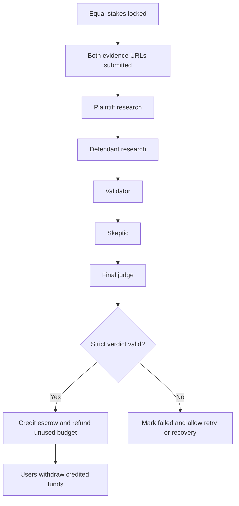
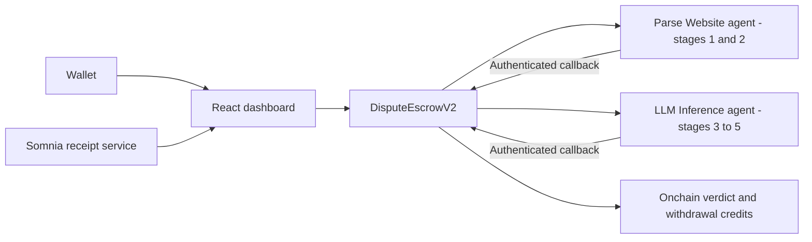

# Gavel - Autonomous Onchain Dispute Resolution

[](https://www.somnia.network/)
[](https://shannon-explorer.somnia.network)
[](https://agents.testnet.somnia.network)
[](test/DisputeEscrowV2.test.js)
[](LICENSE)

> **Primary submission:** `DisputeEscrowV2.sol`, the five-stage autonomous agent jury.
> `DisputeEscrow.sol` (V1) is retained for reference only.

Gavel is an autonomous dispute-resolution protocol on Somnia testnet. Two parties lock equal stakes, submit public evidence URLs, and launch a five-stage chain of Somnia validator-executed agents. The consensus result is returned through authenticated callbacks, validated by the contract, and used to credit escrow for secure withdrawal.

- **Live app:** [gavel-nine.vercel.app](https://gavel-nine.vercel.app)
- **Demo video:** [Watch on YouTube](https://youtu.be/bglHEuVNnBA)
- **Presentation deck:** [Gavel slide deck](https://gavel-nine.vercel.app/gavel-slides)
- **Judge guide:** [SOMNIA_JUDGING.md](SOMNIA_JUDGING.md)

## Why Gavel Needs Somnia

Public evidence is unstructured and lives outside the chain, while the verdict controls funds onchain. A normal AI API or single oracle would become a trusted arbiter.

Somnia Agents let validators execute the evidence parsing and inference jobs, reach consensus, and callback into the escrow contract. One arbitration transaction starts the pipeline; later stages advance automatically without a human judge, keeper, or project-operated backend.

Somnia's EVM compatibility allows the escrow state machine to use standard Solidity and Hardhat tooling. Its low-cost, high-performance architecture matters because a single Gavel case creates five agent requests and multiple validator execution records.

## Gavel vs Human-Juror Arbitration

Kleros and similar systems coordinate human token-staked jurors. Gavel explores a different model:

| Area | Human-juror protocols | Gavel V2 |
|---|---|---|
| Decision makers | Selected human jurors | Somnia validator-executed AI agents |
| Coordination | Voting and incentive process | Five sequential consensus-validated requests |
| Time model | Human response windows | Agent execution and callback pipeline |
| Cost model | Juror incentives plus gas | Somnia request budget plus gas |
| Evidence | Reviewed manually | Public URLs parsed by Somnia agents |
| Enforcement | Contract applies juror result | Contract validates agent verdict and credits escrow |
| Audit trail | Onchain votes | Onchain request IDs/results plus Somnia validator receipts |

Gavel does not claim that validator receipts themselves are stored onchain. The request IDs, callback result, case state, verdict, and escrow credits are onchain. Per-validator execution receipts are served by Somnia's receipt service.

## Five-Stage Autonomous Jury

1. **Plaintiff Research** - LLM Parse Website extracts claims from the plaintiff evidence URL.
2. **Defendant Research** - LLM Parse Website extracts claims from the defendant evidence URL.
3. **Validator** - LLM Inference checks support, contradictions, timestamps, and missing evidence.
4. **Skeptic** - LLM Inference challenges both sides and highlights weak conclusions.
5. **Judge** - LLM Inference returns `GAVEL_V1|winner|confidence|reasoning`.

The contract rejects malformed judge output. A failed stage becomes retryable; persistent failures can enter the escrow recovery path after the safety delay.



## Live Deployment Proof

| Resource | Value |
|---|---|
| V2.1 primary contract | [0x0BCEF4b601A497Db5A57AC211Ed95d01ad009A4A](https://shannon-explorer.somnia.network/address/0x0BCEF4b601A497Db5A57AC211Ed95d01ad009A4A) |
| V2 completed-case proof contract | [0xEd614e7A3A80fd26426c6780cC15cf9a4F003f21](https://shannon-explorer.somnia.network/address/0xEd614e7A3A80fd26426c6780cC15cf9a4F003f21) |
| V1 contract (retired) | [0xdc9A2ea119467AADcee21258A54138A8B138f6c5](https://shannon-explorer.somnia.network/address/0xdc9A2ea119467AADcee21258A54138A8B138f6c5) |
| SomniaAgents platform | [0x037Bb9C718F3f7fe5eCBDB0b600D607b52706776](https://shannon-explorer.somnia.network/address/0x037Bb9C718F3f7fe5eCBDB0b600D607b52706776) |
| AgentRegistry | [0x08D1Fc808f1983d2Ea7B63a28ECD4d8C885Cd02A](https://shannon-explorer.somnia.network/address/0x08D1Fc808f1983d2Ea7B63a28ECD4d8C885Cd02A) |
| LLM Parse Website agent | [12875401142070969085](https://agents.testnet.somnia.network/agent/12875401142070969085) |
| LLM Inference agent | [12847293847561029384](https://agents.testnet.somnia.network/agent/12847293847561029384) |
| Chain ID | `50312` |
| RPC | `https://api.infra.testnet.somnia.network` |

### Completed Case #0

| Proof | Value |
|---|---|
| Create transaction | [0xc978f538...30212b8](https://shannon-explorer.somnia.network/tx/0xc978f5380399c43a1614996cffaf6904cd76d85eaaf4febdc2049104830212b8) |
| Arbitration transaction | [0x053d93da...ef7392](https://shannon-explorer.somnia.network/tx/0x053d93da672cd7e5a1ba4439497c01a815d3c7b72de1b921e814ff30d0ef7392) |
| Plaintiff withdrawal | [0x853709e3...c3414](https://shannon-explorer.somnia.network/tx/0x853709e3c398023ebb494750fe7f6b7ace0054d4729ee536b72ab5ee117c3414) |
| Stage request IDs | `5892205`, `5892264`, `5892316`, `5892338`, `5892357` |
| Validator receipts | `15/15` successful execution traces |
| Consensus verdict | Split, `60%` confidence |

### Explorer Verification Note

The primary V2.1 address contains the latest source and exposes `version() == "2.1.0"`. The earlier V2 address remains linked because it contains the completed five-stage case proof. Verify both deployments and current contract reads with:

```bash
npm run check:bytecode
```

The script verifies bytecode, configured agent IDs, subcommittee size, the live platform request deposit, `minimumAgentBudget()`, and `disputeCount()`. See [outputs/verify-output.txt](outputs/verify-output.txt) for the recorded Hardhat verification result.

Shannon verification was submitted for V2.1 on June 12, 2026. The explorer currently responds `Address is not a smart-contract` while the Somnia RPC returns `18,644` bytes of live code. This is an explorer indexing delay; retry `npm run verify:somnia` after indexing completes.

## Somnia Agent Integration



### Agents Used

**LLM Parse Website** (`ExtractString`) is used for plaintiff and defendant research. It fetches public evidence pages and extracts relevant claims.

**LLM Inference** (`inferString`) is used for validator, skeptic, and judge roles through stage-specific prompts.

**SomniaAgents platform** creates requests, manages request funding, and delivers callbacks to `handleResponse()`.

The JSON API Request agent is documented as a future structured-evidence option. It is not part of the deployed V2 arbitration flow.

## Agent Budget

The V2 contract calculates the minimum dynamically:

```text
(2 x Parse Website request) + (3 x Inference request)
= (2 x 0.33 STT) + (3 x 0.24 STT)
= 1.38 STT at the current live platform deposit
```

| Stage | Current minimum |
|---|---:|
| Plaintiff Research | `0.33 STT` |
| Defendant Research | `0.33 STT` |
| Validator | `0.24 STT` |
| Skeptic | `0.24 STT` |
| Judge | `0.24 STT` |
| **Current live total** | **`1.38 STT`** |

The request deposit is controlled by the Somnia platform and can change. The frontend therefore has no hardcoded production fallback: it reads `minimumAgentBudget()` from the live contract before enabling arbitration. The local mock currently uses a `0.01 STT` deposit and calculates `1.28 STT`, but the deployed platform currently returns a `1.38 STT` total. Unused initial budget is credited back to the arbitration funder.

## V2 Security and Reliability

| Feature | Behavior |
|---|---|
| Strict verdict parser | Only valid `GAVEL_V1` output can resolve escrow |
| Callback authentication | Only the configured Somnia platform can call `handleResponse()` |
| Request-stage binding | Request ID, dispute ID, and expected stage must match |
| Pull payments | A rejecting receiver cannot block verdict completion |
| Retry path | Failed stages can restart with additional funding |
| Timeout fallback | After 15 minutes, anyone can mark an undelivered stage callback as timed out so it becomes retryable |
| Recovery path | Parties recover remaining escrow after the failure delay |
| Evidence freeze | Evidence cannot change after arbitration begins |
| URL and size bounds | Inputs and agent outputs are bounded |
| Party case index | UI loads connected-wallet cases without scanning every dispute |
| Budget accounting | Escrow, agent budget, rebates, and withdrawals remain separate |

## Public Contract Interface

- `createDispute`
- `joinDispute`
- `submitEvidence`
- `requestArbitration`
- `retryFailedStage`
- `recoverFailedDispute`
- `claimExpiry`
- `withdraw`
- `getDispute`
- `getStageRequestIds`
- `getPartyCaseIds`
- `minimumAgentBudget`
- `version`

## Real-World Use Cases

- Freelance milestone disputes backed by a specification and GitHub pull request
- Marketplace disputes backed by listing pages and public evidence
- DAO grants and bounty completion checks
- B2B milestone escrow
- Prediction market resolution from public sources
- Parametric claims backed by public API or website evidence

## Tech Stack

| Layer | Technology |
|---|---|
| Smart contracts | Solidity 0.8.24, Hardhat, viaIR optimizer |
| Frontend | React 19, Vite, RainbowKit, Wagmi, Ethers v6 |
| Chain | Somnia Testnet |
| Agents | Somnia LLM Parse Website and LLM Inference |
| Frontend deployment | Vercel |
| Analytics | Vercel Analytics |

## Local Development

### Prerequisites

- Node.js 18+
- A Somnia testnet wallet funded with STT
- MetaMask or another supported wallet

### Setup

```bash
git clone https://github.com/NikhilRaikwar/Gavel
cd Gavel
npm install
cp .env.example .env
```

Configure `.env`:

```env
PRIVATE_KEY=your_deployer_private_key
SOMNIA_RPC_URL=https://api.infra.testnet.somnia.network
SOMNIA_AGENTS_ADDRESS=0x037Bb9C718F3f7fe5eCBDB0b600D607b52706776
PARSE_WEBSITE_AGENT_ID=12875401142070969085
JUDGE_INFERENCE_AGENT_ID=12847293847561029384
VITE_DISPUTE_ESCROW_ADDRESS=0x0BCEF4b601A497Db5A57AC211Ed95d01ad009A4A
VITE_SITE_URL=https://gavel-nine.vercel.app
```

### Commands

```bash
npm run frontend:dev
npm run contracts:compile
npm run test:v2
npm run contracts:test
npm run frontend:build
npm run check:bytecode
```

## Deploy and Verify

```bash
npm run deploy:somnia
npm run verify:somnia
```

After deploying a new contract, update `DISPUTE_ESCROW_ADDRESS` for verification and `VITE_DISPUTE_ESCROW_ADDRESS` for the frontend.

## Live App Flow

1. Open [gavel-nine.vercel.app](https://gavel-nine.vercel.app).
2. Connect a wallet.
3. Switch to Somnia Testnet, chain ID `50312`.
4. Create a case with the defendant address, description, and stake.
5. The defendant joins with the exact matching stake.
6. Both parties submit public `http://` or `https://` evidence URLs.
7. Either party starts arbitration using the live minimum budget.
8. Watch all five stages in **Live Hearing**.
9. Inspect the consensus verdict and transaction proof.
10. Open **Audit Receipt** for Somnia validator execution records.
11. Withdraw credited funds.

## Test Coverage

The suite covers:

- case creation, joining, and party indexing
- evidence URL rules and evidence freezing
- all five request stages and stored request IDs
- unauthorized, duplicate, empty, and malformed callbacks
- strict winner and confidence parsing
- plaintiff, defendant, and split verdicts
- failed-stage retry and delayed recovery
- expiry restrictions
- agent budget refunds and platform rebate accounting
- pull-payment withdrawals and rejecting receivers
- source version identification

Run the primary submission suite:

```bash
npm run test:v2
```

Run both V1 and V2:

```bash
npm run contracts:test
```

Expected result: **38 passing tests**.

## Judging Criteria

| Criterion | Gavel V2 proof |
|---|---|
| **Functionality** | 38 passing tests, production frontend build, live deployment, completed case, and successful withdrawal |
| **Agent-First Design** | One user transaction launches five sequential Somnia requests; callbacks autonomously advance the remaining stages |
| **Innovation** | Validator and skeptic deliberation challenge evidence before a strict-format verdict controls escrow |
| **Autonomous Performance** | Five stored request IDs, 15/15 live validator receipts, retries, recovery, budget refunds, and pull withdrawals |

## Honest Capability Boundary

- V2 has five autonomous stages implemented with two Somnia base agent types and stage-specific prompts. It does not claim five separately deployed custom agent containers.
- The deployed flow uses Parse Website and LLM Inference. JSON API Request is planned, not live.
- Gavel advances through Somnia Agent callbacks. It does not currently use Somnia Native Reactivity.
- Receipts are served by Somnia's receipt service. Consensus-controlled results and escrow state are onchain.
- Other contracts and agents can call Gavel's public interface, but the demo does not yet show external agent discovery.
- The latest V2.1 source is deployed at the primary address; the completed-case proof remains on the earlier V2 address.

## Security Notes

- `.env` is ignored by git and must remain local.
- `.env.example` contains placeholders and public addresses only.
- Never commit private keys or API keys.
- Rotate any key that may have been exposed.

## License

MIT (c) 2026 Nikhil Raikwar
