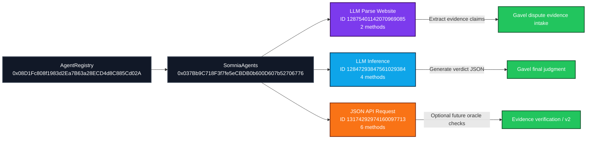
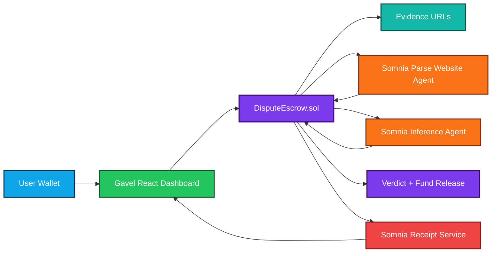
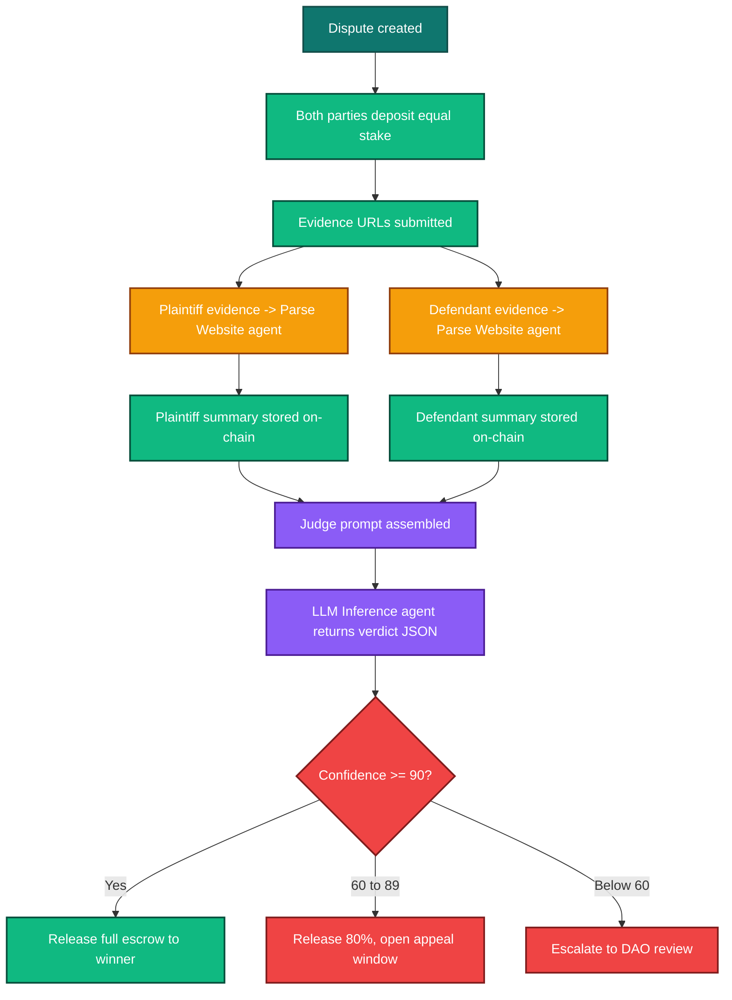

# Gavel

[](https://www.somnia.network/)
[](https://shannon-explorer.somnia.network)
[](https://agents.testnet.somnia.network)
[](https://hardhat.org/)
[](https://vite.dev/)
[](https://react.dev/)
[](LICENSE)

Gavel is an onchain dispute resolution app for Somnia testnet. Two parties stake equal value into escrow, submit evidence, and let deterministic Somnia agents decide the outcome on-chain.

The project uses:
- Somnia Agents for evidence extraction and verdict inference
- A Solidity escrow contract with callback-based agent requests
- A React/Vite dashboard for users to create disputes and follow the live hearing

## Project Snapshot

### Problem

Disputes are slow, expensive, and hard to verify when evidence lives across public URLs, private messages, and off-chain coordination. Traditional escrow systems need a human arbiter or a backend service that users must trust.

### Solution

Gavel turns dispute resolution into an on-chain workflow. Both parties stake equally, submit evidence URLs, and let Somnia validator-executed agents extract claims and return a deterministic verdict with audit receipts.

### Somnia Integration

- Evidence parsing uses the Somnia LLM Parse Website agent
- Final judgment uses the Somnia LLM Inference agent
- Requests are routed through the SomniaAgents platform contract
- Receipts are available from the Somnia receipt service

### Deployment Status

- Deployed on Somnia testnet
- Verified on the Shannon explorer
- Frontend configured to use the deployed contract address
- Wallet-gated landing page and dashboard flow are active

### Demo Flow

1. Connect wallet on the landing page
2. Switch to Somnia testnet if needed
3. Create a dispute and lock escrow
4. Submit evidence URLs for both parties
5. Request arbitration with the minimum agent budget
6. Watch the live hearing and open the receipt
7. Disconnect the wallet to return to the landing page

## What Gavel Does

- Locks equal stakes from both parties into escrow
- Collects evidence URLs from plaintiff and defendant
- Calls Somnia LLM Parse Website agents to extract factual claims
- Calls the Somnia LLM Inference agent to produce a final verdict
- Releases funds automatically based on the verdict confidence
- Stores and displays Somnia receipt data for auditability

## Live Somnia Setup

- Testnet chain ID: `50312`
- RPC: `https://api.infra.testnet.somnia.network`
- Deployed contract: [0xdc9A2ea119467AADcee21258A54138A8B138f6c5](https://shannon-explorer.somnia.network/address/0xdc9A2ea119467AADcee21258A54138A8B138f6c5#code)
- SomniaAgents contract: [0x037Bb9C718F3f7fe5eCBDB0b600D607b52706776](https://shannon-explorer.somnia.network/address/0x037Bb9C718F3f7fe5eCBDB0b600D607b52706776#code)
- AgentRegistry contract: [0x08D1Fc808f1983d2Ea7B63a28ECD4d8C885Cd02A](https://shannon-explorer.somnia.network/address/0x08D1Fc808f1983d2Ea7B63a28ECD4d8C885Cd02A#code)
- LLM Parse Website agent ID: [12875401142070969085](https://agents.testnet.somnia.network/agent/12875401142070969085)
- LLM Inference agent ID: [12847293847561029384](https://agents.testnet.somnia.network/agent/12847293847561029384)
- JSON API Request agent ID: [13174292974160097713](https://agents.testnet.somnia.network/agent/13174292974160097713)

## Somnia Agents Used



## How Gavel Uses Them

- [LLM Parse Website](https://agents.testnet.somnia.network/agent/12875401142070969085)
  - Used for plaintiff and defendant evidence URLs
  - Extracts factual claims from public pages
  - Powers the first two requests in the dispute pipeline

- [LLM Inference](https://agents.testnet.somnia.network/agent/12847293847561029384)
  - Used for the final judge step
  - Returns winner, confidence, and reasoning
  - Determines how escrow is released

- [JSON API Request](https://agents.testnet.somnia.network/agent/13174292974160097713)
  - Reserved for v2 evidence checks when sources are JSON APIs
  - Not required for the MVP arbitration flow

- [SomniaAgents contract](https://shannon-explorer.somnia.network/address/0x037Bb9C718F3f7fe5eCBDB0b600D607b52706776#code)
  - Platform contract that receives requests and routes callbacks

- [AgentRegistry contract](https://shannon-explorer.somnia.network/address/0x08D1Fc808f1983d2Ea7B63a28ECD4d8C885Cd02A#code)
  - Registry layer for Somnia agents and explorer metadata

## Architecture



## AI Agent Flow



## Request Funding Model

Somnia requests must be funded with the operations reserve plus the runner execution budget:

- Parse Website request: `0.33 STT`
- Inference request: `0.24 STT`
- Three-step arbitration total: `0.90 STT`

The contract enforces this by requiring the full minimum arbitration budget before starting the agent pipeline.

## Tech Stack

- Solidity `0.8.24`
- Hardhat
- React
- Vite
- RainbowKit + Wagmi
- Ethers v6
- Somnia testnet agents

## Local Development

1. Install dependencies:

```bash
npm install
```

2. Configure environment variables in `.env`:

```env
PRIVATE_KEY=your_deployer_key
SOMNIA_RPC_URL=https://api.infra.testnet.somnia.network
SOMNIA_AGENTS_ADDRESS=0x037Bb9C718F3f7fe5eCBDB0b600D607b52706776
PARSE_WEBSITE_AGENT_ID=12875401142070969085
JUDGE_INFERENCE_AGENT_ID=12847293847561029384
VITE_DISPUTE_ESCROW_ADDRESS=your_deployed_contract_address
```

3. Start the frontend:

```bash
npm run frontend:dev
```

4. Compile contracts:

```bash
npm run contracts:compile
```

5. Run tests:

```bash
npm run contracts:test
```

6. Build the app:

```bash
npm run frontend:build
```

## Deploy to Somnia Testnet

```bash
npm run deploy:somnia
```

After deployment:
- Copy the deployed contract address into `DISPUTE_ESCROW_ADDRESS`
- Copy the same address into `VITE_DISPUTE_ESCROW_ADDRESS`
- Rebuild or restart the frontend

## Verify on Somnia

```bash
npm run verify:somnia
```

## How to Use the App

1. Open the landing page.
2. Click `Connect wallet`.
3. Connect a wallet and switch to Somnia testnet if prompted.
4. Enter the dashboard.
5. Create a dispute and lock escrow.
6. Submit evidence URLs for both parties.
7. Request arbitration with at least `0.90 STT`.
8. Watch the live hearing and open the receipt after request creation.
9. Disconnecting the wallet returns you to the landing page.

## Testing Checklist

### Smart Contract

- `createDispute()` locks the plaintiff stake
- `joinDispute()` requires matching defendant stake
- `submitEvidence()` only accepts parties
- `requestArbitration()` requires evidence from both sides
- Agent callbacks only accept calls from the Somnia platform
- Parse Website calls use `ExtractString(...)`
- Inference calls use `inferString(...)`
- Request funding respects the live Somnia deposit model

### Frontend

- Landing page requires wallet connection before entering the dashboard
- Disconnecting wallet returns to the landing page
- Somnia testnet chain is enforced
- Receipt view loads from the Somnia receipts service

## Security Notes

- `.env` is ignored by git and should remain local only
- `.env.example` is safe to commit because it contains placeholders and public addresses only
- The deployed contract address is public, but private keys and API keys must never be committed
- If a live private key was exposed outside this machine, rotate it immediately

## Submission Files

Recommended submission artifacts:
- `README.md`
- Project source code
- Contract deployment address
- Presentation deck
- Demo video link

## Checkpoint 2 Submission Text

### Challenge Explanation

Gavel incorporates Somnia Agents to build a deterministic on-chain dispute resolution flow. The project uses the Somnia LLM Parse Website agent to extract factual claims from evidence URLs and the Somnia LLM Inference agent to produce a verdict on-chain. This demonstrates the challenge goal of using Somnia’s validator-executed agents rather than off-chain AI APIs.

### Submission Details

Gavel is a full-stack dispute escrow application built for Somnia testnet. Users connect a wallet, create a case, submit evidence, and request arbitration. The Solidity contract coordinates requests to Somnia agents, receives callbacks, and releases escrow based on the agent verdict. The frontend provides the end-to-end user flow, live request tracking, and receipt viewing for auditability.

### Code Repository

Replace with your repository URL:

`https://github.com/your-team/project`

### Presentation Deck

Replace with your deck link:

`https://docs.google.com/presentation/d/your-deck-id`

### Demo Video

Replace with your video link:

`https://youtu.be/your-video-id`

## Replit Slides Prompt

Copy this into Replit Slides:

```text
Create a polished 8-slide presentation for a Somnia hackathon project called Gavel.

Project summary:
Gavel is an onchain dispute resolution app built on Somnia testnet. Two parties deposit equal stakes into a Solidity escrow contract, submit evidence URLs, and let Somnia agents extract factual claims and infer a verdict on-chain. The app is deterministic, validator-executed, and audit-friendly through Somnia receipts.

Visual direction:
- Theme: premium legal-tech plus blockchain
- Use deep navy, electric cyan, violet, and warm amber accents
- Make it feel modern, sharp, and high-trust
- Use colorful gradients, glassmorphism cards, and strong section headers
- Keep the slides highly readable and presentation-ready

Slide outline:
1. Title slide
   - Gavel
   - Onchain AI court powered by Somnia
   - Short tagline about deterministic dispute resolution

2. Problem
   - Disputes are slow, manual, and expensive
   - Off-chain AI introduces trust issues
   - Traditional escrow lacks transparent decision-making

3. Solution
   - Wallet-connected dispute flow
   - Parties submit evidence
   - Somnia Parse Website agent extracts claims
   - Somnia Inference agent returns the verdict
   - Escrow is released automatically

4. Architecture
   - Show user wallet, React frontend, DisputeEscrow contract, Parse Website agent, Inference agent, receipt service
   - Include the agent callback loop and on-chain settlement

5. Agent workflow
   - Step 1: create dispute
   - Step 2: submit evidence
   - Step 3: parse evidence URLs
   - Step 4: infer verdict JSON
   - Step 5: release or escalate funds

6. Why Somnia
   - Deterministic validator-executed agents
   - Live receipt audit trail
   - Fast testnet UX
   - On-chain AI without backend dependency

7. Demo / user flow
   - Connect wallet
   - Create dispute
   - Submit evidence
   - Request arbitration with 0.90 STT
   - View receipt

8. Closing
   - Gavel transforms escrow into an auditable on-chain court
   - Include code repository, demo video, and contact info

Include speaker notes, bold headlines, and one strong visual per slide. If you add charts or diagrams, make them colorful and minimalist. Export-ready quality is important.
```

## Resume Note

I reviewed the LaTeX resume file you referenced. It is already strong for a Somnia hackathon/job application because it clearly emphasizes:
- Somnia experience
- Hackathon wins
- Solidity + frontend + AI agent work
- Shipping speed and demo ability

Recommended improvement for this specific submission:
- Add `Gavel` as a project entry with a one-line Somnia-focused description
- Mention `on-chain AI court`, `Somnia agents`, and `receipt-based auditability`
- If you submit the resume for the hackathon, keep the wording concrete and technical rather than generic

## License

MIT
